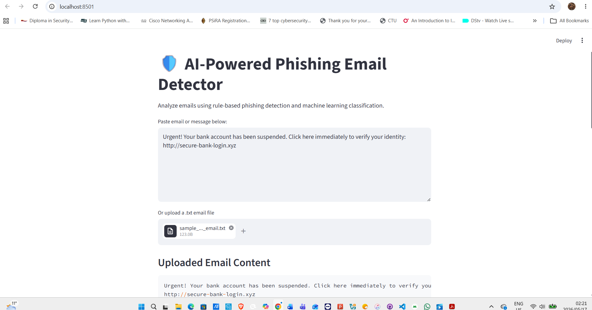
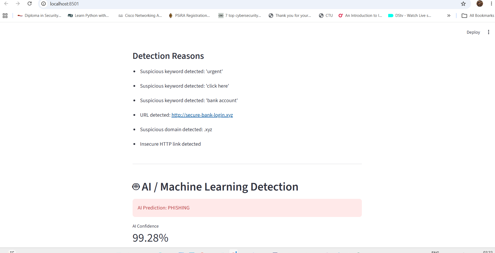
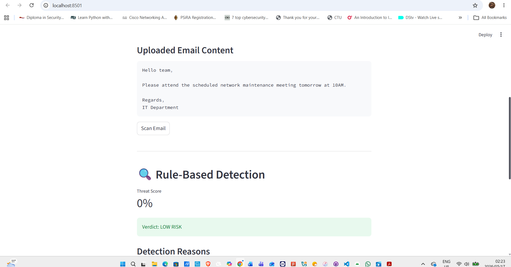
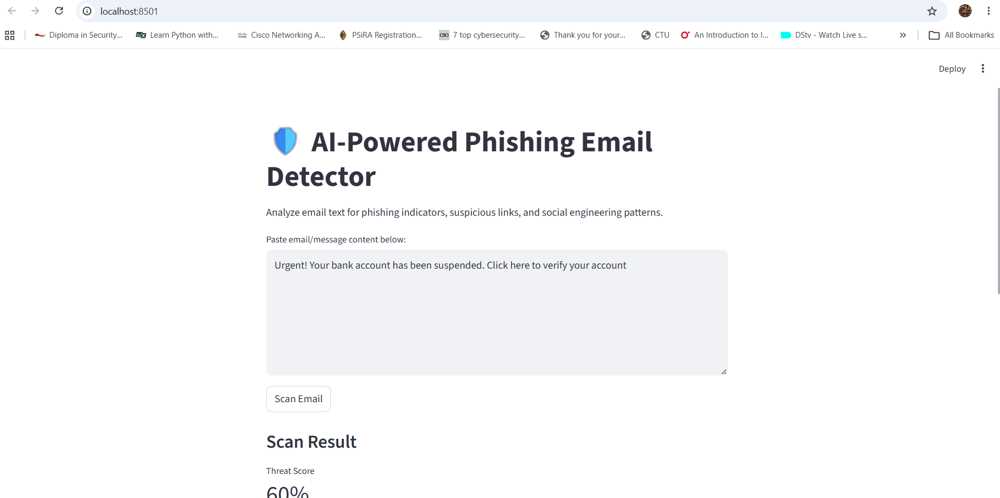
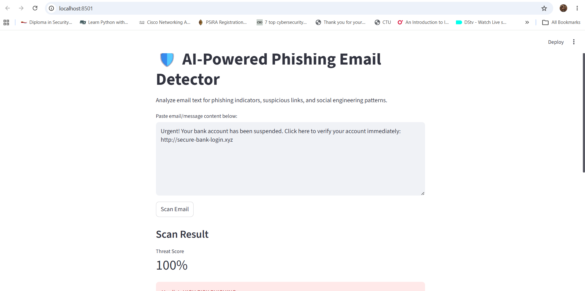
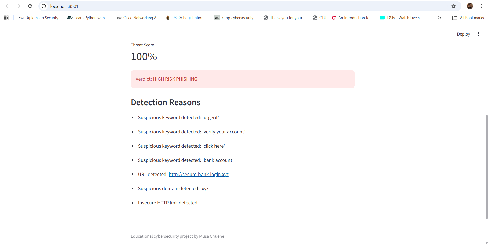
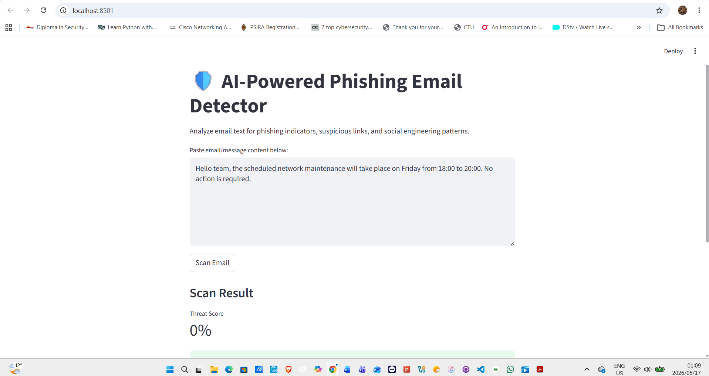
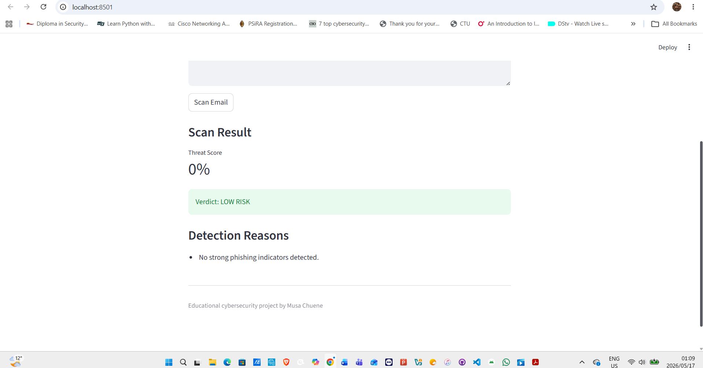

# 🛡️ AI-Powered Phishing Email Detector

## 📌 Overview

AI-Powered Phishing Email Detector is a cybersecurity project developed in Python to analyze email content and identify potential phishing attacks using both rule-based detection and machine learning classification.

The application scans email text for suspicious phishing indicators such as:

- Social engineering language
- Urgent security warnings
- Suspicious URL
- Unsafe domains
- Password reset scams
- Fake banking notifications

The project combines:

- Rule-based threat analysis
- AI / Machine Learning phishing classification
- Streamlit web dashboard visualization

This project simulates a lightweight SOC-style phishing detection tool used in cybersecurity environments.

---

# 🚀 Features

## 🔍 Rule-Based Detection

- Phishing keyword detection
- URL analysis
- Suspicious domain detection
- HTTP link detection
- Threat scoring system
- Detection reasoning output

---

## 🤖 AI / Machine Learning Detection

- Email classification using Scikit-learn
- NLP-based text vectorization
- Naive Bayes phishing classifier
- AI confidence percentage

---

## 🌐 Web Dashboard

- Streamlit interactive dashboard
- Real-time phishing scanning
- Threat score visualization
- AI prediction display
- User-friendly interface

---

# 🛠️ Technologies Used

- Python
- Streamlit
- Pandas
- Scikit-learn
- Machine Learning
- Natural Language Processing (NLP)
- Regular Expressions

---

# 📂 Project Structure

```text
AI_Phishing_Email_Detector/
│
├── app.py
├── dashboard.py
├── detector.py
├── ai_detector.py
├── train_model.py
├── test_ai.py
├── phishing_model.pkl
├── phishing_samples.txt
├── requirements.txt
├── README.md
└── screenshots/
```

---

# ⚙️ How It Works

## 🔍 Rule-Based Engine

The rule-based detection engine scans email content for:

- Suspicious phishing phrases
- Unsafe URLs
- Suspicious top-level domains
- Insecure HTTP links
- Social engineering indicators

Each detected indicator increases the overall phishing threat score.

---

## 🤖 AI / Machine Learning Engine

The AI engine uses:

- CountVectorizer
- Multinomial Naive Bayes

to classify emails as:

- phishing
- safe

The model generates:

- AI prediction
- confidence percentage

based on trained phishing and legitimate email samples.

---

# ▶️ Installation

Clone the repository:

```bash
git clone https://github.com/musechuene-commits/AI_Phishing_Email_Detector.git
```

Move into the project directory:

```bash
cd AI_Phishing_Email_Detector
```

Install dependencies:

```bash
pip install -r requirements.txt
```

---

# ▶️ Running the Application

## Run Terminal Version

```bash
python app.py
```

---

## Run AI Model Training

```bash
python train_model.py
```

---

## Run AI Testing Script

```bash
python test_ai.py
```

---

## Run Streamlit Dashboard

```bash
streamlit run dashboard.py
```

---

# 🧪 Example Phishing Email

```text
Urgent! Your bank account has been suspended. Click here to verify your account immediately: http://secure-bank-login.xyz
```

---

# 📊 Example Output

## Rule-Based Detection

```text
Threat Score: 100%
Verdict: HIGH RISK PHISHING
```

---

## AI Detection

```text
Prediction: phishing
Confidence: 97%
```

---

# 📸 Screenshots

## Email File Upload Feature



---

## Uploaded Phishing Email Scan



---

## Uploaded Safe Email Scan



## Streamlit Dashboard



---

## High-Risk Phishing Detection



---

## Safe Email Detection



---

## AI Confidence Score



---

## Machine Learning Detection



---

# 🎯 Learning Outcomes

This project demonstrates practical understanding of:

- Cybersecurity threat detection
- Phishing analysis
- Security automation
- Python development
- Machine learning fundamentals
- NLP basics
- Streamlit dashboard development
- SOC-style investigation logic

---

# 🔮 Future Improvements

Planned upgrades include:

- Real phishing datasets
- Email file upload support
- URL reputation checking
- VirusTotal API integration
- CSV logging
- SQLite database integration
- Dark mode dashboard
- Admin analytics panel
- Live email monitoring

---

# ⚠️ Disclaimer

This project is intended for educational and authorized cybersecurity learning purposes only.

---

# 👨‍💻 Author

## Musa Chuene

- GitHub: https://github.com/musechuene-commits
- LinkedIn: https://linkedin.com/in/musa-chuene-57a4461a8